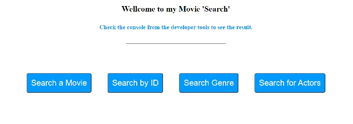

# THE MOVIE DATABASE API 'SEARCH'

## START:

    1 - Escribe en el input la pélicula, el ID, el género o el actor que quieras buscar.

    2 - Pulsa su respectivo botón.

    3 - Checkea la consola para comprobar el resultado.

## TECNOLOGIES:

    · HTML5
    · CSS - FLEXBOX
    · JS VANILLA
    · POSTMAN
    · THE MOVIE DATABASE API

## PROCESS PROJECT:

    Poder realizar una busqueda y obtener un resultado desde THE MOVIE DATABASE API.

## PROCESS DESCRIPTION:

    He realizado un Layaout bastante sencillo para poder escribir en un input, pulsar un botón y obtener un resultado mediante la consola.

    En cuanto a JS he realizado lo siguiente:
    
    He seleccionado los elementos del DOM mediante 'document.query.selector' para generar un evento 'on.click' de las siguientes funciones:

        Función de busqueda por pélicula.
        Función de busqueda por ID.
        Función de busqueda por género.
        Función de busqueda por actores.

    Todas las funciones tienen la misma lógica:

        Realizo un evento 'on.click' y le añado un event.prevent.Default para cancelar el evento si este es cancelable, y así poder ser llamado de nuevo.

        Mas tarde, obtengo el valor del elemento input asignandole un valor a la query y creo una constante para añadirle la URL predefinida a cada función.

        Para obtener el valor de las URL, he usado `backticks` en algunos casos para obtener la query o las variables que necesitaba para que la URL sea correcta. Dichas variables contienen, la base de la URL, la API KEY, un recurso y un critério.

        Después realizo un fetch, el cual todavía no comprendo muy bién, pero intentaré explicarlo. 
        
        Sé que es una función, con la cual, obtengo un resultado del JSON de la URL que estoy llamando. Al consultar el JSON obtengo la 'data' que he solicitado mediante la URL. Además dentro del 'fetch', utilizo un 'catch', para gestionar los posibles errores que pueda tener dicha consulta. En caso de error, saldría mediante la consola un mensaje de error realizado por mí para avisar al usuario de que algo no ha ido como esperabamos.

## I'M A BUG:

    - El botón de búsqueda por género solo devuelve la raiz de todos los géneros de las péliculas, no el género de la pélicula en si que estariamos consultando.

    - El botónde búsqueda por actores no funciona, de momento.

## TO IMPROVE MY CODE:

    - Me gustaría ser capaz de refactorizar este código cuando tenga más conocimientos, para poder realizar la busqueda desde solo un botón. De esta manera el usuario tendría un 'feel' mas adecuado a la experiencia esperada.

    - Intuyo que debería de ser una única función de busqueda que sea capaz de buscar y encontrar la data consultada.

## LINKS

    GIT-HUB: https://github.com/Roo-Git/DB-MOVIE-API
    
    GIT-HUB PAGES: https://roo-git.github.io/DB-MOVIE-API/

## ABOUT ME

    EMAIL: robert.martinez.delafuente@gmail.com

    GIT-HUB - Roo-Git

        

    